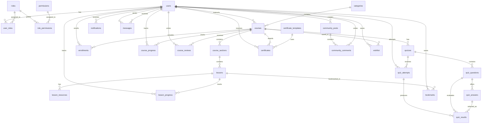

# Learn.Amani ERD

```mermaid
erDiagram
    users ||--o{ user_roles : has
    roles ||--o{ user_roles : assigned_to
    roles ||--o{ role_permissions : grants
    permissions ||--o{ role_permissions : assigned_to

    users ||--o{ courses : instructs
    categories ||--o{ courses : contains
    courses ||--o{ course_sections : contains
    course_sections ||--o{ lessons : contains
    lessons ||--o{ lesson_resources : has
    users ||--o{ enrollments : enrolls
    courses ||--o{ enrollments : includes
    users ||--o{ lesson_progress : tracks
    lessons ||--o{ lesson_progress : tracks
    users ||--o{ course_progress : tracks
    courses ||--o{ course_progress : tracks
    users ||--o{ course_reviews : writes
    courses ||--o{ course_reviews : receives
    courses ||--o{ quizzes : has
    quizzes ||--o{ quiz_questions : contains
    quiz_questions ||--o{ quiz_answers : offers
    users ||--o{ quiz_attempts : attempts
    quizzes ||--o{ quiz_attempts : receives
    quiz_attempts ||--o{ quiz_results : produces
    quiz_questions ||--o{ quiz_results : evaluates
    quiz_answers ||--o{ quiz_results : selected_as
    users ||--o{ certificates : receives
    courses ||--o{ certificates : awards
    certificate_templates ||--o{ certificates : uses
    users ||--o{ notifications : receives
    users ||--o{ messages : sends
    users ||--o{ messages : receives
    users ||--o{ community_posts : creates
    community_posts ||--o{ community_comments : contains
    users ||--o{ community_comments : writes
    users ||--o{ wishlist : saves
    courses ||--o{ wishlist : saved_in
    users ||--o{ bookmarks : saves
    lessons ||--o{ bookmarks : bookmarked_in
```
